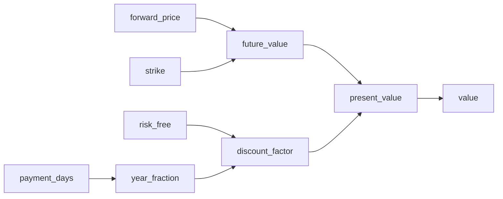

# 03 — Inspect a formula

**Run it:** `uv run python docs/examples/03_inspect_a_formula.py`

The same declaration that computes prices also explains itself. You can query a
formula at import time — before any data exists — and get back a precise
description of what it needs, what it computes, and how the terms depend on each
other.

## Introspection methods

| Method | Returns |
|--------|---------|
| `formula.required_inputs()` | Contract columns the caller *must* supply |
| `formula.explain(view=)` | Human-readable description: inputs, market reads, formula path, output |
| `formula.to_mermaid(view=)` | Mermaid `flowchart LR` — paste into [mermaid.live](https://mermaid.live) |
| `formula.info(view=)` | `GraphInfo` dataclass: `market_outputs`, `formula_nodes` |
| `formula.dependencies_of(term)` | Transitive upstream names of a given term |

## Forward formula flowchart



## Source

```python
--8<-- "docs/examples/03_inspect_a_formula.py"
```
